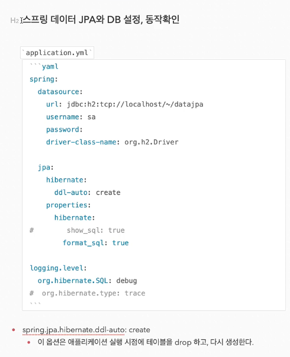

gradle 의존관계 보기

./gradlew dependencies --configuration compileClasspath

테스트 라이브러리
- spring-boot-starter-test
- junit : 테스트 프레임워크, 스프링 부트 2.2 부터 junit5('jupiter')사용
- 과거 버전은 'vintage'
- mockito : 목 라이브러리
- asserj : 테스트 코드를 좀 더 편하게 작성하게 도와주는 라이브러리
- spring-test : 스프링 통합 테스트 지원

핵심 라이브러리

- 스프링 MVC
- 스프링 ORM
- JPA, 하이버네이트
- 스프링 데이터 JPA

기타 라이브러리
- H2 데이터베이스 클라이언트
- 커넥션 풀 : 부트 기본은 HikariCP
- 로깅 SLF4J & LogBack
- 테스트

파일로 h2 DB 생성

jdbc:h2:~/"생성파일"

